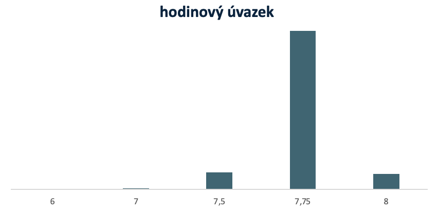
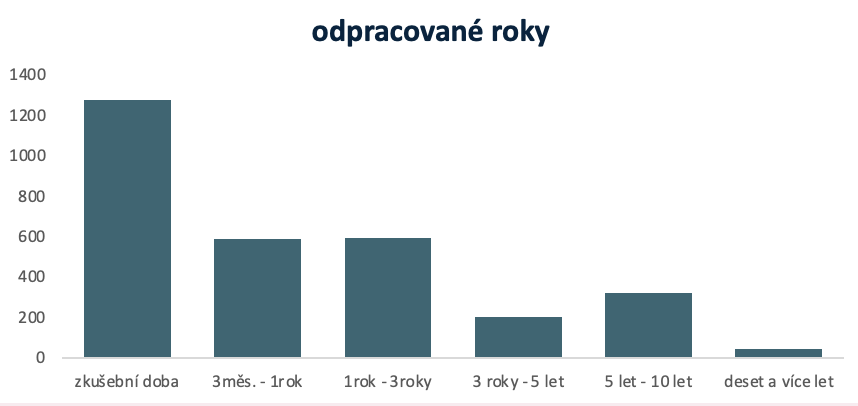
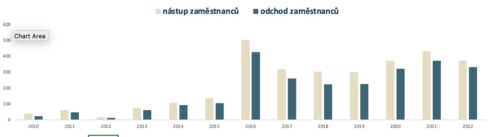
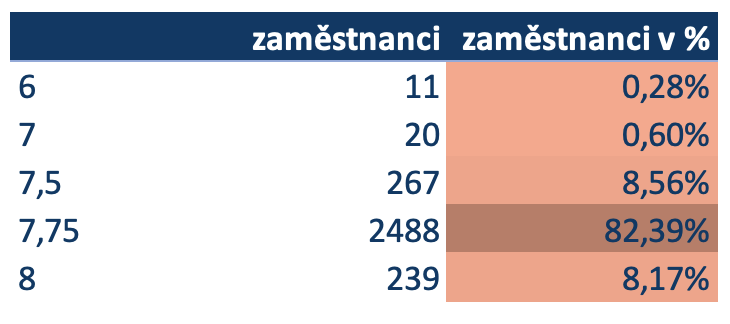

# Excel HR dashboard project

## Dashboard pro HR oddělení     


Odkaz na můj **Linkedln** [ZDE](https://www.linkedin.com/in/mat%C4%9Bj-frol%C3%ADk-183812230/) 

-------

### Úvod do projektu
Cílem projektu je zobrazit v grafech a tabulkách údaje o zaměstnancích společnosti.

### Jednotlivé kroky projektu
1. Úprava přidělených dat, příprava nových sloupců pro následné grafické zobrazení počtu odpracovaných let a počtu propuštěných a stále pracujících osob.
2. Vytvoření pomocných sheetů pro PivotTables a následné vytvoření PivotCharts.
3. Vytvoření sheetu s názvem report obsahující přehladné grafy zobrazující informace o zaměstnancích.
4. Vytvoření sheetu pro grafické zobrazení tabulek s údaji o zaměstnancích.
5. Úprava slicerů a grafické podoby dashboardu.

</br>

IF podmínka pro zobrazení počtu odpracovaných let.
```
=IF([@[months_from_entry]]<3;"zkušební doba";IF(AND([@[months_from_entry]]>=3;[@[months_from_entry]]<12);"3měs. - 1rok";IF(AND([@[months_from_entry]]>=12;[@[months_from_entry]]<36);"1rok - 3roky";IF(AND([@[months_from_entry]]>=36;[@[months_from_entry]]<60);"3 roky - 5 let";IF(AND([@[months_from_entry]]>=60;[@[months_from_entry]]<120);"5 let - 10 let";"deset a více let")))))
```

### Grafické znázornění údajů o zaměstnancích.







